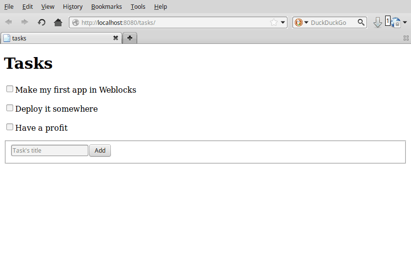
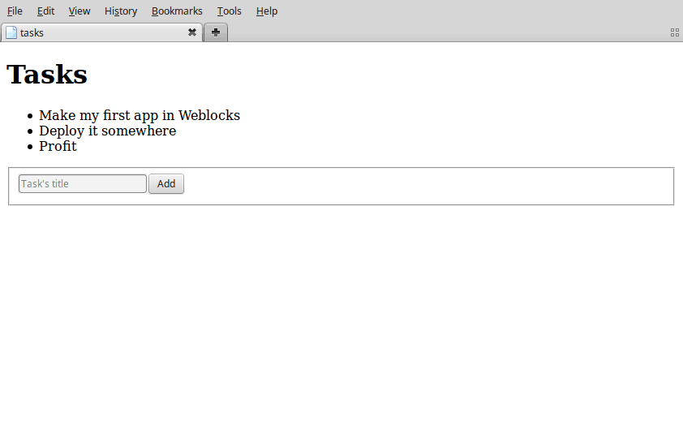

<a id="x-28WEBLOCKS-2FDOC-2FINDEX-3A-40README-2040ANTS-DOC-2FLOCATIVES-3ASECTION-29"></a>

# Quickstart

> This version of Weblocks is not in Quicklisp yet. To
> install it you need to clone the repository somewhere where
> `ASDF` will find it, for example, to the `~/common-lisp/` directory.
> You also need to clone [weblocks-ui][f3cf].
> 
> You can also install the [Ultralisp][3e27] Quicklisp distribution where all Weblocks-related libraries are present and up to date.
> 
> 

Load weblocks and create a package for a sandbox:

```
CL-USER> (ql-dist:install-dist "http://dist.ultralisp.org/"
                               :prompt nil)
CL-USER> (ql:quickload '(:weblocks :weblocks-ui :find-port))
CL-USER> (defpackage todo
           (:use #:cl
                 #:weblocks-ui/form
                 #:weblocks/html)
           (:import-from #:weblocks/widget
                    #:render
                    #:update
                    #:defwidget)
           (:import-from #:weblocks/actions
                    #:make-js-action)
           (:import-from #:weblocks/app
                    #:defapp))
#<PACKAGE "TODO">
CL-USER> (in-package todo)
#<PACKAGE "TODO">
```
Now, create an application:

```
TODO> (defapp tasks)
```
By default, the name of the app defines the url where it is
accessible. Here, the "tasks" app will be accessible under
[http://localhost:40000/tasks][5ff5]. We can change it with the
`PREFIX` argument of [`weblocks/app:defapp`][92cd]:

```
TODO> (defapp tasks
         :prefix "/")
```
Now our app runs under the root url.

```
TODO> (weblocks/debug:on)
TODO> (defvar *port* (find-port:find-port))
TODO> (weblocks/server:start :port *port*)
 <INFO> [19:41:00] weblocks/server server.lisp (start) -
  Starting weblocks WEBLOCKS/SERVER::PORT: 40000
  WEBLOCKS/SERVER::SERVER-TYPE: :HUNCHENTOOT DEBUG: T
 <INFO> [19:41:00] weblocks/server server.lisp (start-server) -
  Starting webserver on WEBLOCKS/SERVER::INTERFACE: "localhost"
  WEBLOCKS/SERVER::PORT: 40000 DEBUG: T
 #<SERVER port=40000 running>
 (NIL)
```
Open [http://localhost:40000/tasks/][2e0b] in your browser (double check the port) and you'll see a
text like that:

```
No weblocks/session:init method defined.
Please define a method weblocks.session:init to initialize a session.

It could be something simple, like this one:

(defmethod weblocks/session:init ((app tasks))
            "Hello world!")

Read more in the documentaion.
```
It means that you didn't write any code for your application. Let's do
it now and make an application which outputs a list of tasks.

In the end, we'll build the mandatory `TODO`-list app:



<a id="the-task-widget"></a>

## The Task widget

```
TODO> (defwidget task ()
        ((title
          :initarg :title
          :accessor title)
         (done
          :initarg :done
          :initform nil
          :accessor done)))
```
This code defines a task widget, the building block of our
application. [`weblocks/widget:defwidget`][0071] is similar to Common Lisp's `DEFCLASS`,
in fact it is only a wrapper around it. It takes a name, a list of
super-classes (here `()`) and a list of slot definitions.

We can create a task with `MAKE-INSTANCE`:

```
TODO> (defvar *task-1* (make-instance 'task :title "Make my first Weblocks app"))
TODO> *task-1*
#<TASK {1005406F33}>
```
Above, we provide only a `TITLE` argument, and since we didn't give a `DONE` argument,
it will be instanciated to its initform, which is `NIL`.

We defined accessors for both slots, so we can read and set them easily:

```
TODO> (title *task-1*)
"Make my first Weblocks app"
TODO> (done *TASK-1*)
NIL
TODO> (setf (done *TASK-1*) t)
T
```
We define a constructor for our task:

```
TODO> (defun make-task (title &key done)
        (make-instance 'task :title title :done done))
```
It isn't mandatory, but it is good practice to do so.

If you are not familiar with the Common Lisp Object System (`CLOS`), you
can have a look at [Practical Common Lisp][9dee]
and the [Common Lisp Cookbook][7210].

Now let's carry on with our application.

<a id="the-tasks-list-widget"></a>

## The Tasks-list widget

Below we define a more general widget that contains a list of tasks,
and we tell Weblocks how to display them by *specializing* the
[`weblocks/widget:render`][f259] generic-function for our newly defined classes:

```
TODO> (defwidget task-list ()
        ((tasks
          :initarg :tasks
          :accessor tasks)))

TODO> (defmethod render ((task task))
        "Render a task."
        (with-html
              (:span (if (done task)
                         (with-html
                               (:s (title task)))
                       (title task)))))

TODO> (defmethod render ((widget task-list))
        "Render a list of tasks."
        (with-html
              (:h1 "Tasks")
              (:ul
                (loop for task in (tasks widget) do
                      (:li (render task))))))
```
The [`weblocks/html:with-html`][174e] macro uses
[Spinneret][a443] under the hood,
but you can use anything that outputs html.

We can check how the generated html looks like by calling
[`weblocks/widget:render`][f259] generic-function in the `REPL`:

```
TODO> (render *task-1*)
<div class="widget task"><span>Make my first Weblocks app</span>
</div>
NIL
```
But we still don't get anything in the browser.

```
TODO> (defun make-task-list (&rest rest)
        (let ((tasks (loop for title in rest
                        collect (make-task title))))
          (make-instance 'task-list :tasks tasks)))

TODO> (defmethod weblocks/session:init ((app tasks))
         (declare (ignorable app))
         (make-task-list "Make my first Weblocks app"
                         "Deploy it somewhere"
                         "Have a profit"))
```
This defines a list of tasks (for simplicity, they are defined as a
list in memory) and returns what will be our session's root widget..

Restart the application:

```
TODO> (weblocks/debug:reset-latest-session)
```
Right now it should look like this:


<div class=demo>
 <iframe
         sandbox="allow-forms allow-same-origin allow-scripts"
         id=example-230
         src="http://localhost:40000/examples/weblocks/doc/quickstart/example1?iframe-id=example-230"
         style="width: 100%; height: 10em; border: 0"></iframe>
</div>
<script>
window.addEventListener('message', function(e) {
  let message = e.data;
  let iframe_id = message.iframe_id;
  let iframe = document.querySelector('#' + iframe_id);
  iframe.style.height = message.height + 'px';
  iframe.style.width = message.width + 'px';
} , false);
</script>

<a id="adding-tasks"></a>

## Adding tasks

Now, we'll add some ability to interact with a list – to add some tasks
into it, like so:



Import a new module, [weblocks-ui][f3cf] to help in creating forms and other `UI` elements:

```
TODO> (ql:quickload "weblocks-ui")
TODO> (use-package :weblocks-ui/form)
```
Write a new `ADD-TASK` method and modify the `RENDER` method of a
task-list to call `ADD-TASK` in response to `POST` method:

```
TODO> (defmethod add-task ((task-list task-list) title)
        (push (make-task title)
              (tasks task-list))
        (update task-list))
            
TODO> (defmethod render ((task-list task-list))
        (with-html
          (:h1 "Tasks")
          (loop for task in (tasks task-list) do
            (render task))
          (with-html-form (:POST (lambda (&key title &allow-other-keys)
                                         (add-task task-list title)))
            (:input :type "text"
                    :name "title"
                    :placeholder "Task's title")
            (:input :type "submit"
                    :value "Add"))))

TODO> (weblocks/debug:reset-latest-session)
```
The method `ADD-TASK` does only two simple things:

* it adds a task into a list;

* it tells Weblocks that our task list should be redrawn.

This second point is really important because it allows Weblocks to render
necessary parts of the page on the server and to inject it into the `HTML` `DOM`
in the browser. Here it rerenders the task-list widget, but we can as well [`weblocks/widget:update`][cb7e]
a specific task widget, as we'll do soon.

We are calling `ADD-TASK` from a lambda function to catch a
`TASK-LIST` in a closure and make it availabe when weblocks will
process `AJAX` request with `POST` parameters later.

Another block in our new version of `RENDER` of a `TASK-LIST` is the form:

```
(with-html-form (:POST #'add-task)
   (:input :type "text"
    :name "task"
    :placeholder "Task's title")
   (:input :type "submit"
    :value "Add"))
```
It defines a text field, a submit button and an action to perform on
form submit.

Go, try it! This demo is interative:


<div class=demo>
 <iframe
         sandbox="allow-forms allow-same-origin allow-scripts"
         id=example-231
         src="http://localhost:40000/examples/weblocks/doc/quickstart/example2?iframe-id=example-231"
         style="width: 100%; height: 15em; border: 0"></iframe>
</div>
<script>
window.addEventListener('message', function(e) {
  let message = e.data;
  let iframe_id = message.iframe_id;
  let iframe = document.querySelector('#' + iframe_id);
  iframe.style.height = message.height + 'px';
  iframe.style.width = message.width + 'px';
} , false);
</script>

> **This is really amazing!**
> 
> With Weblocks, you can handle all the business logic
> server-side, because an action can be any lisp function, even an
> anonymous lambda, closuring all necessary variables.
> 
> 

Restart the application and reload the page. Test your form now and see in a
[Webinspector][c3de] how Weblocks sends requests to the server and receives
`HTML` code with rendered `HTML` block.

Now we'll make our application really useful – we'll add code to toggle the tasks' status.

<a id="toggle-tasks"></a>

## Toggle tasks

```
TODO> (defmethod toggle ((task task))
        (setf (done task)
              (if (done task)
                  nil
                  t))
        (update task))

TODO> (defmethod render ((task task))
        (with-html
          (:p (:input :type "checkbox"
            :checked (done task)
            :onclick (make-js-action
                      (lambda (&key &allow-other-keys)
                        (toggle task))))
              (:span (if (done task)
                   (with-html
                         ;; strike
                         (:s (title task)))
                 (title task))))))
```
We defined a small helper to toggle the `DONE` attribute, and we've
modified our task rendering function by adding a code to render a
checkbox with an anonymous lisp function, attached to its
`ONCLICK` attribute.

The [`weblocks/actions:make-js-action`][b26e] function returns a Javascript code,
which calls back a lisp lambda function when evaluated in the browser.
And because `TOGGLE` updates a Task widget, Weblocks returns on this
callback a new prerendered `HTML` for this one task only.

Here is how our app will work now:


<div class=demo>
 <iframe
         sandbox="allow-forms allow-same-origin allow-scripts"
         id=example-232
         src="http://localhost:40000/examples/weblocks/doc/quickstart/example3?iframe-id=example-232"
         style="width: 100%; height: 15em; border: 0"></iframe>
</div>
<script>
window.addEventListener('message', function(e) {
  let message = e.data;
  let iframe_id = message.iframe_id;
  let iframe = document.querySelector('#' + iframe_id);
  iframe.style.height = message.height + 'px';
  iframe.style.width = message.width + 'px';
} , false);
</script>

<a id="what-is-next"></a>

## What is next?

As a homework:

1. Play with lambdas and add a "Delete" button next after
   each task.

2. Add the ability to sort tasks by name or by completion flag.

3. Save tasks in a database (this [Cookbook chapter][63e3] might help).

4. Read the [`Routing`][507a] section.

5. Read the rest of the documentation and make a real application, using the full
   power of Common Lisp.


[b26e]: actions.html#x-28WEBLOCKS-2FACTIONS-3AMAKE-JS-ACTION-20FUNCTION-29
[92cd]: apps.html#x-28WEBLOCKS-2FAPP-3ADEFAPP-20-2840ANTS-DOC-2FLOCATIVES-3AMACRO-29-29
[174e]: html.html#x-28WEBLOCKS-2FHTML-3AWITH-HTML-20-2840ANTS-DOC-2FLOCATIVES-3AMACRO-29-29
[5ff5]: http://localhost:40000/tasks
[2e0b]: http://localhost:40000/tasks/
[9dee]: http://www.gigamonkeys.com/book/object-reorientation-classes.html
[c3de]: https://developers.google.com/web/tools/chrome-devtools/inspect-styles/
[f3cf]: https://github.com/40ants/weblocks-ui/
[a443]: https://github.com/ruricolist/spinneret/
[7210]: https://lispcookbook.github.io/cl-cookbook/clos.html
[63e3]: https://lispcookbook.github.io/cl-cookbook/databases.html
[3e27]: https://ultralisp.org/
[507a]: routing.html#x-28WEBLOCKS-2FDOC-2FROUTING-3A-40ROUTING-2040ANTS-DOC-2FLOCATIVES-3ASECTION-29
[0071]: widgets.html#x-28WEBLOCKS-2FWIDGET-3ADEFWIDGET-20-2840ANTS-DOC-2FLOCATIVES-3AMACRO-29-29
[f259]: widgets.html#x-28WEBLOCKS-2FWIDGET-3ARENDER-20GENERIC-FUNCTION-29
[cb7e]: widgets.html#x-28WEBLOCKS-2FWIDGET-3AUPDATE-20GENERIC-FUNCTION-29

* * *
###### [generated by [40ANTS-DOC](https://40ants.com/doc/)]
